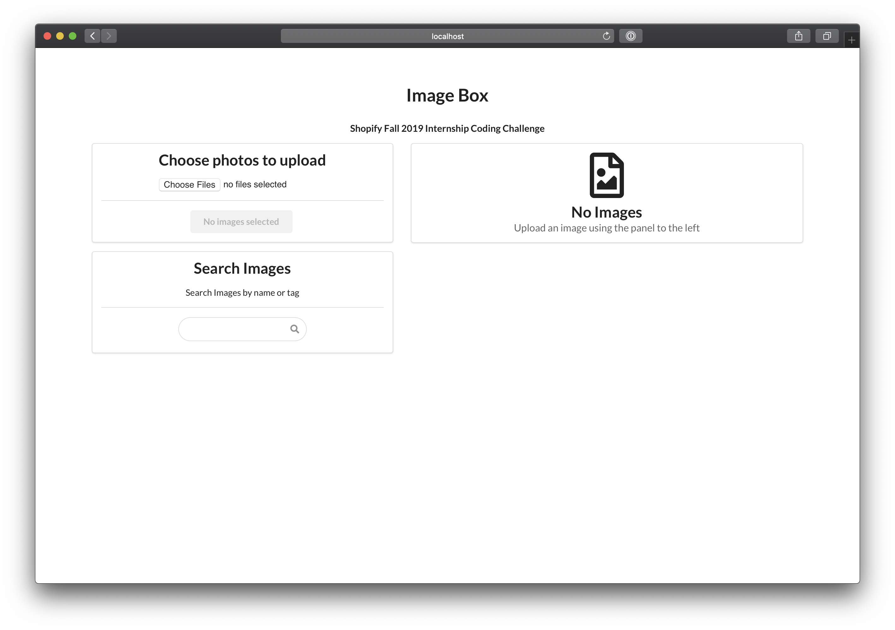
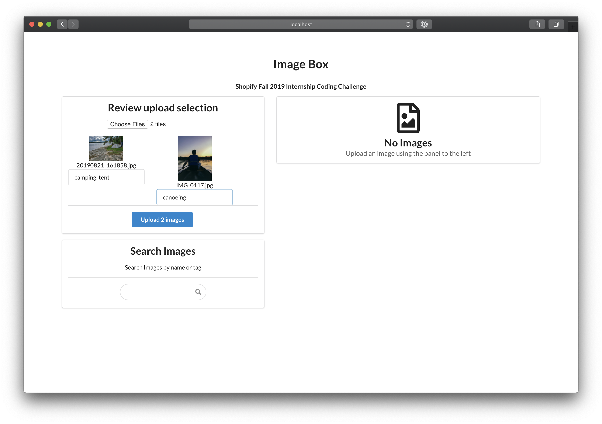
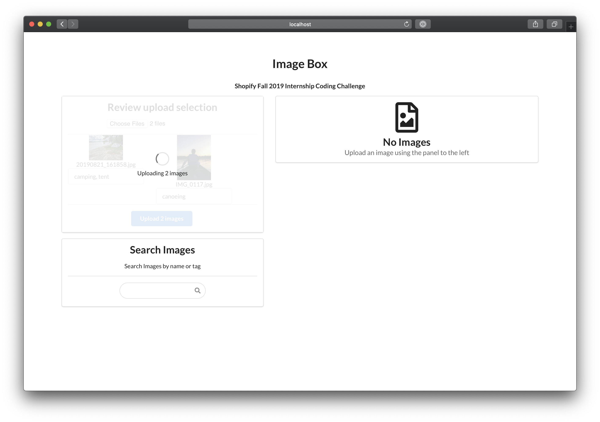
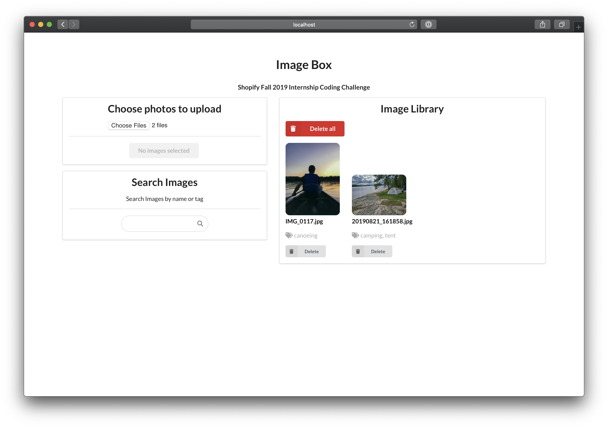

# image-box

image-box is an online image repository for uploading and saving images online. Created for the Shopify Developer Intern Coding challenge.


## Usage

After cloning the repo, create a `.env` file and set the environment variables outlined in `.env-example`. These environment variables are all authentication from Firebase, and can be found in the **Firebase console**.

Once the `.env` file has been properly created, run 

```
yarn install
```

To properly install all dependencies.


Once all dependencies have been installed run

```
yarn start
```


This will start the local development server on `localhost:3000`.


## Technologies

- [React](https://reactjs.org)
- [Cloud Firestore](https://firebase.google.com/products/firestore/)
- [Firebase Cloud Storage](https://firebase.google.com/products/storage/)

This image repository was built using the [React](https://reactjs.org) JavaScript framework for UI. Individual UI components came from [Semantic UI for React](https://react.semantic-ui.com)

[Firebase](https://firebase.google.com/) is used to store images and their references/tags. Images themselves are stored in Firebase's [Cloud Storage](https://firebase.google.com/products/storage/), and all references and tags are stored in a [Cloud Firestore](https://firebase.google.com/products/firestore/) database.

## Screenshots

### Initial view

### Adding images

### Uploading images

### View with images
